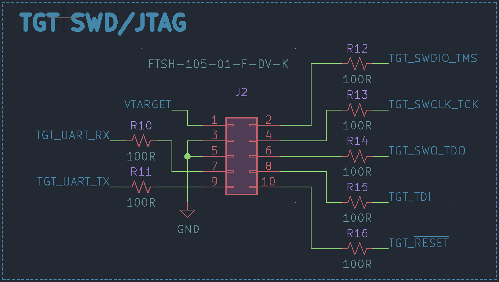

<p align="center">
  <h3 align="center">⚡ Glasslink</h3>
  <p align="center">
    CMSIS-DAP Compatible Debugger & Programmer for ARM M-Cores
  </p>
</p>

<br />

[](https://creativecommons.org/licenses/by/4.0/)
### Development ⚡
The Glasslink hardware is currently developed in the open source ECAD software [KiCAD](https://www.kicad.org/). The board was created using as many of the included component symbols and footprints as possible. Any custom components are located in the ```Glasslink.lib``` and ```Glasslink.pretty``` files. Additional 3D models were also added to the designa and can be found in the ```models``` folder. The KiCAD [Teardrops](https://github.com/stimulu/kicad-teardrops) extension was used to add teardrops to SMD pads and Vias.

### Board Bring-up 🔼
Once you have a physical piece of hardware in hand, you can begin flashing and setting the device up for your use. The Glasslink hardware is intended to run the open-source firmware [DAPLink](https://github.com/ARMmbed/DAPLink/tree/develop) which supports Drag-N-Drop flashing of certain targets, CDC serial port, CMSIS-DAP WinUSB & HID debug channel as well as WebUSB debug channels. The tested Firwmare has been built using the current ```develop``` branch (as of ```12/10/2021```) using the ```GNU Arm Embedded Toolchain 10-2020-q4-major``` toolchain. More information on building standalone firmware or firmware intended for a specific target (utilizing MSC/Drag-N-Drop) - see [here](https://github.com/ARMmbed/DAPLink/tree/develop/docs).

Once you are ready to flash firmware to the DAPLink hardware, you can utilize the built-in NXP USB ROM Bootloader. A fresh piece of hardware should enumerate immediately into the bootloader when the USB is plugged in. Otherwise, you can hold down the ```nRESET``` pushbutton while plugging in the USB. The ROM Bootloader will enumerate as a MSD labeled ```CRP_DISABLED```.

#### Windows
On windows, to flash a piece of Glasslink hardware you can simply drag your compiled firmware onto the storage device found in File Explorer.

#### Linux
On linux, the ```dd``` command is used to write the firmware to your Glasslink hardware
```console
sudo dd if=lpc11u35_if.bin of=/media/user/CRP\ DISABLD/firmware.bin conv=notrunc
```

### Usage 💻
There are two common applications for utilizing the Glasslink debug probe: [PyOCD](https://pyocd.io/) and [OpenOCD](https://openocd.org/). Check the documentation for each on how to connect a probe, flash a target, debug, etc.

#### CDC Serial Port
The Glasslink hardware enumerates not only as a CMSIS-DAP probe, but also as a CDC serial port. This port can be utilized to send UART/serial data from your Target to a connected Host PC. On Windows a new ```COM``` port should enumerate and on Linux a new ```ACM``` port should enumerate when the Glasslink probe is connected.

To connect the Glasslink serial lines to your targets UART, please reference the 10pin ARM header pinout below. The current design assumes that you are creating your target hardware and have the ability to route your UART pins to the "unused" pins of the SWD header.

**```NOTE - The UART switching for TX<->RX and RX<->TX is done for you on the Glasslink hardware. The target TX pin sould go to pin 9 of the 10pin ARM header.```**


